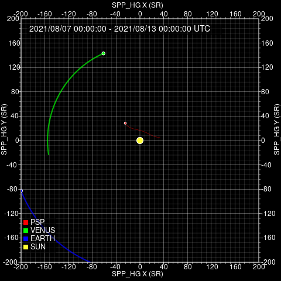

# Encounter 9

The ninth encounter of Parker Solar Probe provides observations down to 0.074 au (15.9 RS). Due to the majority of the encounter having footpoints on the far side of the Sun, there was no footpoint prediction campaign for this encounter.

